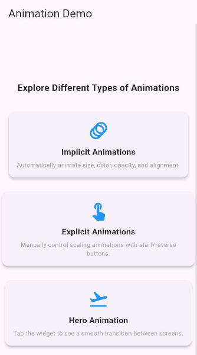

# 🎬 Flutter Animations Demo
A practical example showcasing three essential types of animations in Flutter:

✅ **Implicit Animations** – Automatically animate size, color, alignment, and opacity changes.  
✅ **Explicit Animations** – Manually control animations using `AnimationController`.  
✅ **Hero Animation** – Smooth transitions between screens using shared elements.

## 📸 Preview


## 🚀 Features
- Implementation of **implicit animations** (`AnimatedContainer`, `AnimatedOpacity`, `AnimatedAlign`, `AnimatedSwitcher`).
- Usage of **explicit animations** with `AnimationController`, `Tween`, `CurvedAnimation`, and `AnimatedBuilder`.
- **Hero Animation** for seamless transitions between screens.
- **Simple and intuitive UI** with a main screen allowing easy navigation between animation sections.

## 📂 Project Structure
```bash
  
    flutter_animations_basic/
    │── lib/
    │   ├── main.dart               # Main screen with navigation
    │   ├── implicit_animations.dart # Implicit animations
    │   ├── explicit_animations.dart # Explicit animations
    │   ├── hero_animation.dart      # Hero Animation
    │── assets/                      # Graphic assets (optional)
    │── pubspec.yaml                  # Dependency configuration
    │── README.md                     # Project documentation
    
```

## 🛠️ Installation

1. **Clone the repository**

```bash

git clone git@github.com:betazetadev/flutter-animations-basic.git

```

2. **Navigate to project directory**

```bash

cd flutter_animations_basic

```

3. **Get packages**

```bash

flutter pub get

```

4. **Run the app**

```bash

flutter run

```

# 📄 License

This project is licensed under the MIT License.
